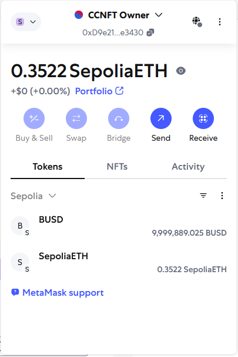
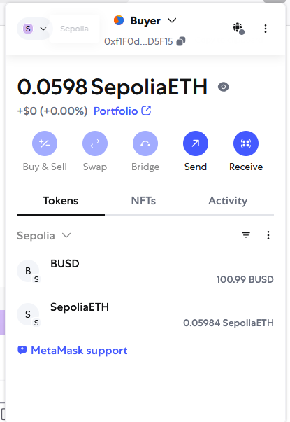
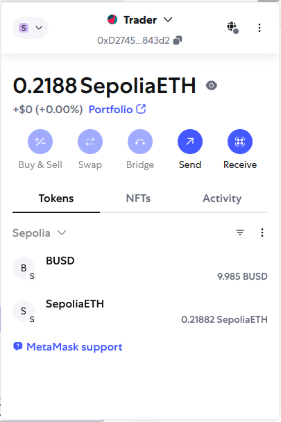
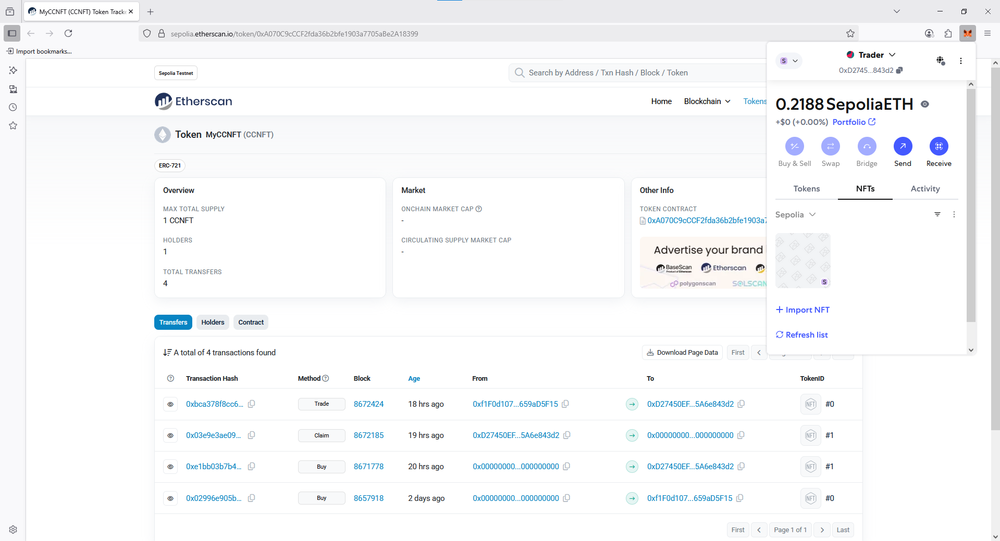
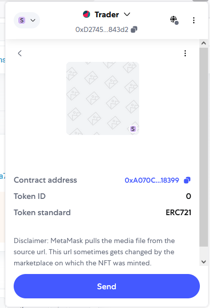

## Contrato CCFNT (ERC721) y tokens BUSD (ERC20)

## Inicializacion

Al realizar `make deploy` se genera un .env_addresses con las direcciones del contrato ERC721 CCNFT `CCNFT_CONTRACT_ADDRESS` y del ERC20 BUSD `BUSD_CONTRACT_ADDRESS`.

Como requisito para correr este proyecto hace falta definir las siguientes variables de entorno.

* `SEPOLIA_RPC_URL` URL del RPC de testnet sepolia que vamos a usar para deployar el contrato y en el cual vamos a realizar las transacciones.
* `OWNER_PRIVATE_KEY` private key del account que va a contener los BUSD y donde se van a depositar los fees.
* `BUYER_PRIVATE_KEY` private key del account que va a usarse para demostrar la operacion de compra y put on sale.
`TRADER_PRIVATE_KEY` private key de una tercera account que va usarse para hacer la compra del NFT publicado por `BUYER_PRIVATE_KEY`, que luego puede emplearse para la operación de claim.

Requisitos para realizar `make buy`:

* Correr `make fund_accounts` para otorgarle tokens BUSD a `BUYER_PRIVATE_KEY`.
* Correr `make approve_tokens` para otorgarle al contrato CCNFT permisos para la wallet de `BUYER_PRIVATE_KEY`.

Requisitos para realizar `make trade`:

* Haber completado un `make buy` con el Buyer account.
* Haber realizado un `make put_on_sale` con el Buyer.
* Haber corrido `make approve_tokens_trader` para habilitar operaciones sobre el account de `TRADER_PRIVATE_KEY`.

Requisitos para realizar `make claim`:

* Haber completado un `make trade` con el Trader account.

## EtherScan logs

Aqui se encuentran enlaces de EtherScan para los contratos y las distintas operaciones.

### EtherScan Sepolia CCFNT (ERC721)

https://sepolia.etherscan.io/address/0xA070C9cCCF2fda36b2bfe1903a7705aBe2A18399

### EtherScan Sepolia BUSD (ERC20) 

https://sepolia.etherscan.io/address/0x49D5a52D9c5301b23060B9de151654d2cB0F125e

### Operacion de aprove token

Ejemplo approve tokens: https://sepolia.etherscan.io/tx/0x6afa06355cb3a34e84d0268b58f02c58ab655b8181e30113f4e2f926d75ad76f

### Transfer de fondos a Buyer

Ejemplo de transferencia de fondos BUSD (100) a buyer: https://sepolia.etherscan.io/tx/0x4fb53a76fd0dfe79635d98e14b59a3008254bc581434ef5e0fd91d232eb491f9

### Buy desde account Buyer

Ejemplo transaccion buy: https://sepolia.etherscan.io/tx/0xe1bb03b7b475dc9b5e96c9235f869d631eed4324b6bfa1528910946a6bbcb9f8

### Put on Sale de NFT desde Buyer

https://sepolia.etherscan.io/tx/0xb9faab2cfdd9964ac43d7ea1989b44e2f8c9b8de604c87938e1972b9a1729529

### Trader inicia trade sobre el NFT con tokenId 0 de Buyer

https://sepolia.etherscan.io/tx/0xbca378f8cc6be97b5236f4e3f488f30ada3016402654b81257a6123d9e9c4897

### Approve tokens para Trader (requerido para hacer claim)

https://sepolia.etherscan.io/tx/0xb792c27a42ec9d32618b657956f29569f4bfe93c43e14ff8aaa954fbad13ade4

### Claim sobre TokenId 1 desde Trader

https://sepolia.etherscan.io/tx/0x03e9e3ae098511dab11569e7287dc25b7637f838cc07aa4242e8aa80b0ea8b70

## Capturas Metamask

#### Owner Address Tokens

#### Buyer Address Tokens

#### Trader Address Tokens

#### Trader NFTs (#0 Traded, #1 Claimed)

## Makefile actions

Para los comandos del makefile se han creado scripts para `configure`, `buy`, `claim`, `deploy`, `trade` y otros. Estos se encuentran en la carpeta /makefile_scripts y son invocados desde el Makefile. Se pueden ver archivos .log de las distintas operaciones en /makefile_scripts.

Aqui se detallan cada uno de los comandos soportados por el makefile:

### configure

El paso `configure` sirve para inicializar y configurar el contrato CCNFT con los valores iniciales. Después de que contratos inteligentes como BUSD (un ERC20 token) y CCNFT (su NFT contract) son desplegados en la blockchain el paso `configure` es ejecutado por la OWNER_ADDRESS.
Los cambios que realiza son:

1.  **Asocia BUSD con CCNFT:** Le indica al CCNFT contract qué ERC20 token (su BUSD token) debe usarse para las transacciones (por ejemplo, la compra de NFTs).

2.  **Configura el fundCollector y feedCollector:** Define quién recibe los fondos y las fees generadas por el contract (en este caso, la OWNER_ADDRESS para simplificar).

3.  **Habilita las funciones de buy, claim y trade:** Activa las características clave del CCNFT contract, como permitir a los usuarios comprar, reclamar e intercambiar NFTs. Sin esto, estas funciones estan deshabilitadas por defecto por seguridad.

4.  **Define valor del token NFT y Limits:** Establece parámetros como el valor máximo que se puede recaudar (un número grande para permitir operaciones flexibles) y especifica los valores de NFT_VALUE válidos que se pueden usar para nuevos NFTs.

5.  **Definicion de impuesto por transacción:** Configura las fees para las operaciones de buy y trade, que contribuyen a los flujos de ingresos del contract.

En esencia, el `configure` prepara los contratos desplegados para que los usuarios interactúen con él, definiendo las reglas y parámetros.

### fund_accounts:

**Propósito** Este step transfiere BUSD tokens de la wallet del contract owner a la BUYER_ADDRESS. El buyer necesita estos tokens para poder comprar NFTs desde el contrato CCNFT.

**Acción:** `make fund_accounts`.

### approve_tokens:

**Propósito** Después de ser financiado, el buyer necesita darle al contrato CCNFT permiso (una "aprobación") para gastar los BUSD tokens en su nombre cuando compren un NFT. Es una medida standard de seguridad con contratos ERC20.

**Acción:** `make approve_tokens`.

### buy:

**Propósito** Aquí es donde el buyer realmente compra un NFT desde el contrato CCNFT.

**Acción:** `make buy`.

### put_on_sale:

**Propósito** Una vez que el buyer posee un NFT, puede ponerlo a la venta en el contrato CCNFT. Este step requiere que que se ingrese manualmente el tokenId del NFT que se compró previamente.

**Acción:** `make put_on_sale`.

### trade:

**Propósito** Un nuevo trader (TRADER_ADDRESS) puede comprar el NFT que fue puesto a la venta por el buyer. Esto también implica financiar al trader con BUSD y que aprueben el contrato CCNFT para que opere con el BUSD de su cuenta. Para la operación de trade también ingresamos el tokenId.

**Acción:** `make trade`.

### claim:

**Propósito** El dueño actual del NFT (después del trade, sería la TRADER_ADDRESS) puede hacer "claim", lo que típicamente significa quemar el NFT y recuperar su valor en BUSD. Este paso requiere también definir el tokenId que se quiere quemar.

**Acción:** `make claim`.